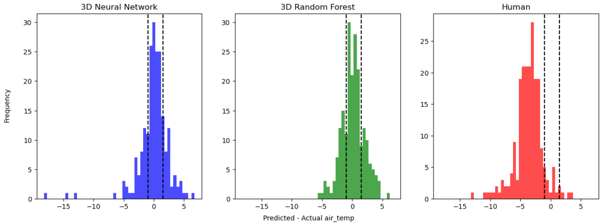

# desi-mirror-temp
An experiment to see if machine learning models can be used to improve upon human predictions for temperatures inside the DESI dome.

A MLP neural network was trained on a set of telemetry data from DESI in order to predict what the temperature in the dome will be at night during the time of observation. A paper with more details on the project can be found at: (**INSERT DESI WIKI LINK HERE**).
